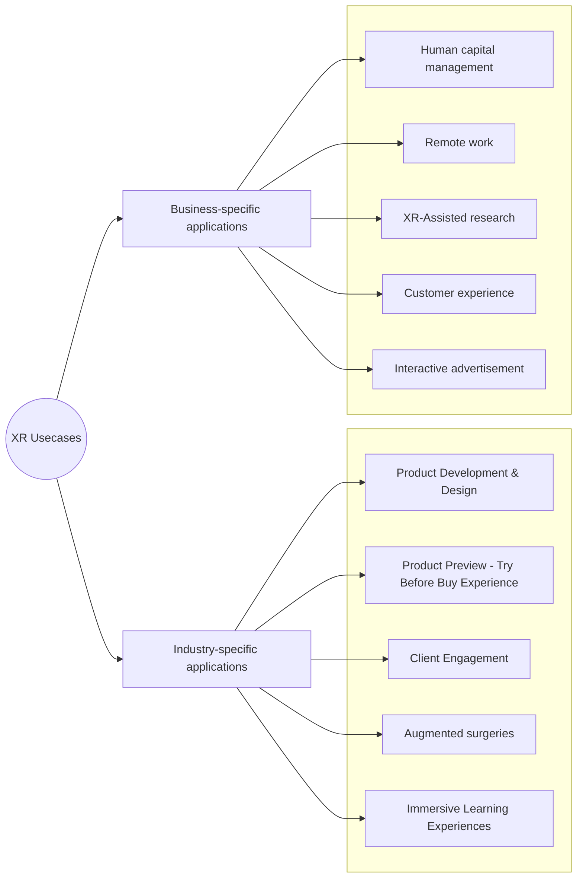

# Extended Reality
## Table of Contents
- [Definition](/docs/README.md#what-really-is-the-extended-reality-xr)
- [Importance](/docs/README.md#why-is-it-so-important)
- [Types of Extended Reality](/docs/README.md#types-of-extended-reality)
- [Current State](/docs/README.md#current-xr-state)
- [User Interaction](/docs/README.md#extended-reality-xr-user-interaction)
- [Business Applications](/docs/README.md#extended-reality-applications-for-business)
- [Challenges and Limitations](/docs/README.md#current-challenges-and-limitations-of-extended-reality)

### What really is the Extended Reality (XR)?
Extended Reality is a catch-all "umbrella" term used to describe [immersive technologies](https://www.sciencedirect.com/topics/psychology/immersive-technology) that can merge the physical and virtual world, including [Augmented Reality (AR)](/docs/augmented-reality/README.md), [Virtual Reality (VR)](/docs/virtual-reality/README.md), and [Mixed Reality (MR)](/docs/mixed-reality/README.md) plus those that are still to be created. 

All immersive technologies are intended to combine or mirror the physical world with a "digital twin world" able to interact with it, by either [blending the virtual and "real" worlds](/docs/augmented-reality/README.md) or by creating a [fully immersive experience](/docs/virtual-reality/README.md).

The areas of virtual reality and augmented reality are in constant growth being applied in a wide range of areas such as:
- Entertainment
- Marketing
- Education
- and many other applications...

## Why is it so important?
The Extended Reality (XR) offers a more engaging and immersive experience, enabling users to interact with digital content in a natural and intuitive way. Allowing customization, and tailoring experiences to individual preferences or needs in a diverse set of [applications](/docs/README.md#extended-reality-applications-for-business).

Furthermore, as the XR technology evolves, it opens up possibilities for innovative applications yet to be explored, and combined with [artificial intelligence](https://www.ibm.com/topics/artificial-intelligence) and the [Internet of Things (Iot)](https://www.ibm.com/topics/internet-of-things) can revolutionize how we interact with technology.

It highly improves the [accessibility  for people with disabilities](https://xraccess.org/), offering new ways to interact with the world, and it has the potential to connect people globally in more immersive ways, transcending the physical boundaries.

✅  Enhances the employees training outcomes (soft and hard skills)
✅  Reduce costs by increasing efficiency in operations
✅  Improves and modernizes the customers experience
✅  Increases the brand status from the competency

> [!tip]
> Overall, XR's importance lies in its ability to transform various industries, enhance user experiences, and pave the way for innovative advancements in technology and human interaction.

## Types of Extended Reality

[Augmented Reality or AR](/docs/augmented-reality/README.md) refers to a set of technologies that enable users to view part of the real world through a [technological device with added (virtual) graphical information](/docs/hardware.md) (like headsets and goggles). The device, overlays virtual information onto existing physical information, creating a fusion where virtual elements appear within reality. Tangible physical elements blend with virtual elements, resulting in a real-time augmented experience.

  

[Virtual Reality or VR](/docs/virtual-reality/README.md) is a computer-generated simulation of an environment that enables users to interact and immerse themselves in a realistic like three-dimensional environment through the use of specialized wearable equipment, such as headsets, haptic suits and other trackers. It typically involves sensory experiences, including visual, auditory, and sometimes tactile feedback, to create the illusion of presence in a virtual world that can be explored and manipulated.

  
 

[Mixed Reality (MR)](/docs/mixed-reality/README.md) merges elements of both [augmented reality (AR)](/docs/augmented-reality/README.md) and [virtual reality (VR)](/docs/virtual-reality/README.md) to create environments where physical and digital objects coexist and interact which each other in real time, blending the physical and virtual "worlds", offering a spectrum where digital and real-world elements can coexist and interact in a seamless and interactive manner [(Holographic/Immersive)](/docs/mixed-reality/README.md).|

  
>[!tip] 
> **Wrapping Up - The differences in a nutshell**
> - *Augmented Reality (AR)*: Pass-through vision with the "real world" on the background, has "virtual" overlays on top of it. It could be interactive (tap in device).
>  >
> - *Virtual Reality (VR):* 100% 3D virtual world that is much more interactive than the Augmented Reality with [special equipment](/docs/hardware.md), capable of track more movements and actions. No "real world" on the background stuff :(
> >
> - Mixed Reality (MR): It's when the Augmented Reality (AR) fully interacts in real time with the real "world"; Merges the AR and VR concepts into one, it's highly interactive and supports a virtual environment on top of the real world. 
## Current XR State
[AR technology is expected to grow rapidly in the future](https://www.marketsandmarkets.com/Market-Reports/extended-reality-market-147143592.html), driven by the increasing adoption of smart devices, the continuous development of 5G technology, and the surging demand for AR solutions in various applications. According to the report, the extended reality market, which includes AR, VR, and MR, is projected to reach USD 111.5 billion by 2028 from USD 40.1 billion in 2023, at a CAGR of 22.7% from 2023 to 2028. 

Some of the prominent players in the extended reality market include Microsoft, Google, Apple, Samsung, and HTC. These companies have used various strategies, such as product launches, partnerships, acquisitions, and expansions, to strengthen their position in the market.

## Extended Reality (XR) User Interaction
Understanding how users interact within these immersive environments is crucial for designing compelling experiences.
1. **Input Devices**: Users interact via controllers, gestures, voice commands, or brain-computer interfaces (BCI), translating real-world actions into digital commands.
2. **Spatial Interaction**: Users manipulate 3D virtual objects, mimicking real-world interactions such as grabbing and moving objects.
3. **Presence and Immersion**: XR aims to create a sense of "being there," immersing users in responsive and convincing virtual worlds.
4. **User Interface (UI) and User Experience (UX)**: Intuitive interfaces, clear instructions, and minimal cognitive load are essential for smooth user experiences.
5. **Social Interaction**: XR enables collaboration and socialization through avatars, real-time communication, and shared experiences.
6. **Customization and Personalization**: Tailoring experiences to individual preferences enhances engagement, offering customizable avatars and settings.
7. **Accessibility**: Designing for diverse abilities ensures inclusivity, considering various disabilities and user needs.
8. **Feedback and Responsiveness**: Immediate and accurate feedback to user actions enhances immersion and engagement.
## Extended Reality Applications for Business

XR has the potential to improve experiences for a vast majority of industries-specific applications and business-specific applications and consumers. Some of them being:  

>
 - [Retail](/docs/applications/retail.md): Extend Reality gives customers the ability to try before they buy.  The Rolex watch company for example, have an app that allows customers to try on watches on your actual wrist; or IKEA a furniture company, gives customers the ability to place furniture items into their home via their smartphones.
 >
 - [Training](/docs/applications/training.md): It's mainly used in life-and-death circumstances, in this category the extended reality can provide training tools that are hyper-realistic that will help soldiers, health care professionals, pilots, astronauts, engineers, architects, chemist, and more to figure out solutions to problems or learn how to respond to dangerous circumstances without any risk. Or even to EA Sports, on-boarding experiences, and customer assistance.
 >
 - [Remote Work](/docs/applications/remote-work.md): Workers can connect to the home office or with professionals located around the globe in a way that makes all party members feel like they are in the same room and share ideas in a smoother way. It can connect people and increase the interaction experience.
 >
 - [Marketing](/docs/applications/marketing.md): The unlimited possibilities to engage with prospective customers and consumers through [Extended Reality](/docs/README.md) with interactive posts, animated banners or billboards, will have marketing professionals pondering all the potential of using [Extending Reality](/docs/README.md) to their company’s advantage.
 >
 - [Real Estate](/docs/applications/real-estate.md): Finding buyers or tenants might be easier if individuals can “walk through” spaces to decide if they want it even when they are in some other location.  Urban planifications, and more.
 >
 - [Entertainment](/docs/applications/entertainment.md): As an early adopter, the entertainment industry will continue to find new ways of utilizing immersive technologies.
 
## Current challenges and limitations of Extended Reality
#### 1. Data Security and Privacy
The development of [Extended Reality](/docs/README.md) Those developing [Extended Reality](/docs/README.md) technologies are battling with some of the challenges to mainstream adoption. First, [Extended Reality](/docs/README.md) technologies collect and process huge amounts of very detailed and personal data about what you do, what you look at, your surroundings and even your emotions at any given time, which has to be protected and privately managed.

#### 2. Hardware Capabilities
Although XR technology is advancing quickly, it is still dependent on many technologies, and the cost of implementing those technologies, requires a sophisticated team of developers with prior knowledge on 3D design and implementation; Furthermore it is essential that the wearable devices that allow the [Extended Reality](/docs/README.md) experience are fashionable and comfortable as well as always connected, intelligent, with good [specifications](/docs/hardware.md) to bring an immersive experience, such as:
- [Computer Vision & Deep Learning](/docs/ai/README.md)
- [3D Graphics & Edge Computing](/docs/graphics/README.md)
- [Sensors](/docs/hardware.md)
- ...

#### 3. Costs
Since XR is a relatively new technology, the [hardware](/docs/hardware.md) and supportive systems that facilitate XR are costly compared to conventional technologies. Further advancements are needed to make XR commercially viable and scalable. However, most costs associated with XR are upfront, whether it be hardware or development costs. This makes XR a beneficial long-term investment.

#### 4. Legal & moral concerns
There are questions arising about the legality and morality of acts conducted in virtual environments with XR. With the advances in immersive technologies and graphics capabilities, it is not sci-fi to think that we can create a very realistic virtual replica of a person without consent. Concepts such as violence, pornography, etc., can be carried to immersive virtual environments, which raise the necessity for regulation and governance.

#### 5. Health Concerns and Accessibility
There are several health concerns are in consideration regarding XR usage. These are:
- Motion sickness
- Eye strain
- Headaches
- Social isolation
- Dizziness

And there's no clear standards addressing the [accessibility of augmented reality technologies](/docs/accesibility/README.md) for people with disabilities. However, it's being [worked on](https://xraccess.org/) right now.

> Taking periodic breaks to socialize and rest is a viable solution to XR exhaustion. Hardware comfort and warnings directed at the user can also significantly improve user experience.
